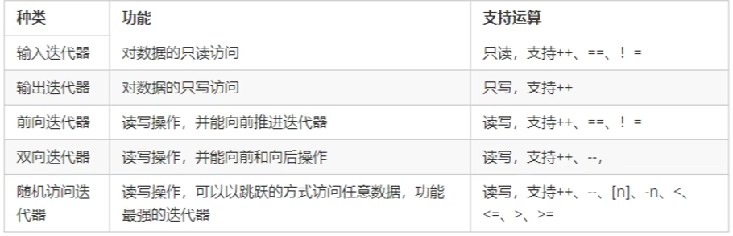

# STL

## 基本概念

- STL（Standard Template Library，标准模板库）
- STL从广义上分为：容器（contaniner）算法（algorithm）迭代器（iterator）
- 容器和算法之间通过迭代器进行无缝连接
- STL几乎所有的代码都采用了模板类或者模板函数

## STL六大组件

容器、算法、迭代器、仿函数、适配器、空间配置器

- 容器：各种数据结构、vector、list、deque、set、map等
- 算法：各种常用的算法、sort、find、copy、for_each等
- 迭代器：容器与算法之间的胶合剂
- 仿函数：行为类似函数，可作为算法的某种策略
- 适配器：一种用来修饰容器或仿函数或迭代器接口的东西
- 空间适配器：负责空间的适配与管理

## STL中容器、算法、迭代器

常用的数据结构：数组、链表、树、栈、队列、集合、映射表等

这些容器分为**序列式容器**和关联式容器两种：

序列式容器：强调值的排序，序列式容器中的每个元素均有固定的位置。

关联式容器：二叉树结构，各元素之间没有严格的物流上的顺序关系

算法（Algorithms）

算法分为：质变算法、非质变算法

质变算法：运算过程中会更改区间内的元素的内容。例如拷贝、替换、删除等

非质变算法：运算过程中不会更改区间内的元素内容，例如查找、计数、遍历等

迭代器：容器和算法之间的粘合剂

常用的容器中迭代器种类分为双向和随机访问迭代器；

